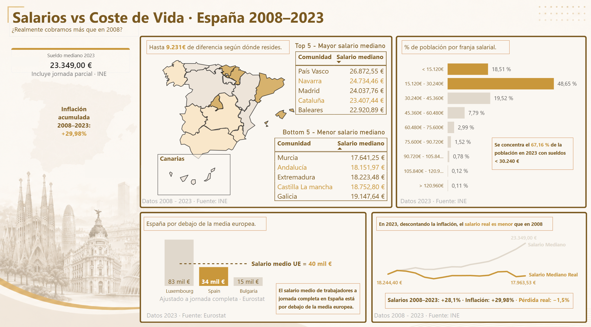
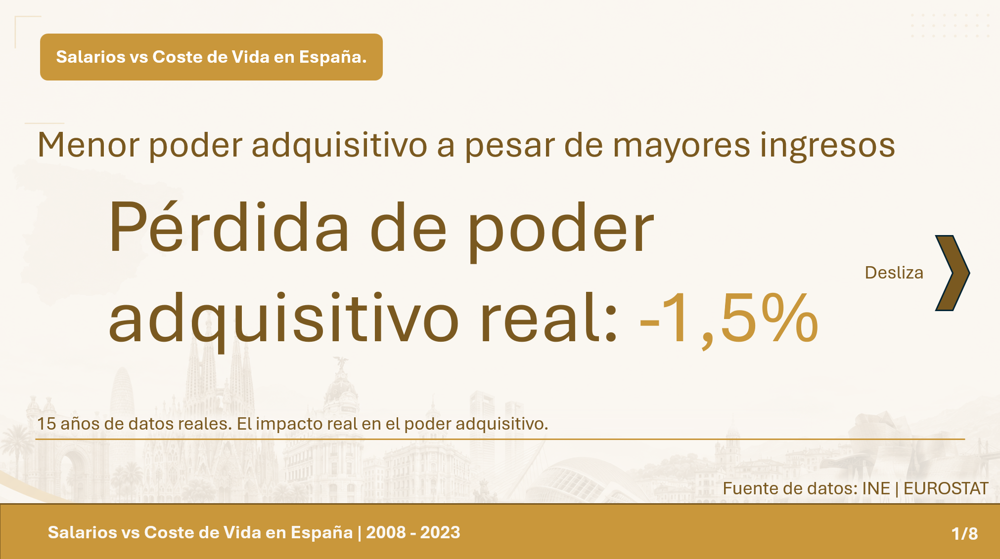
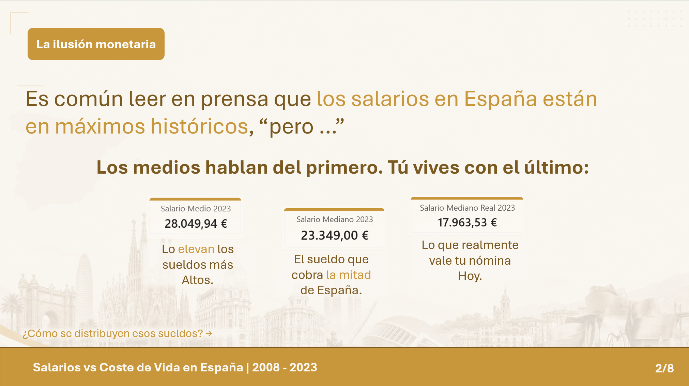
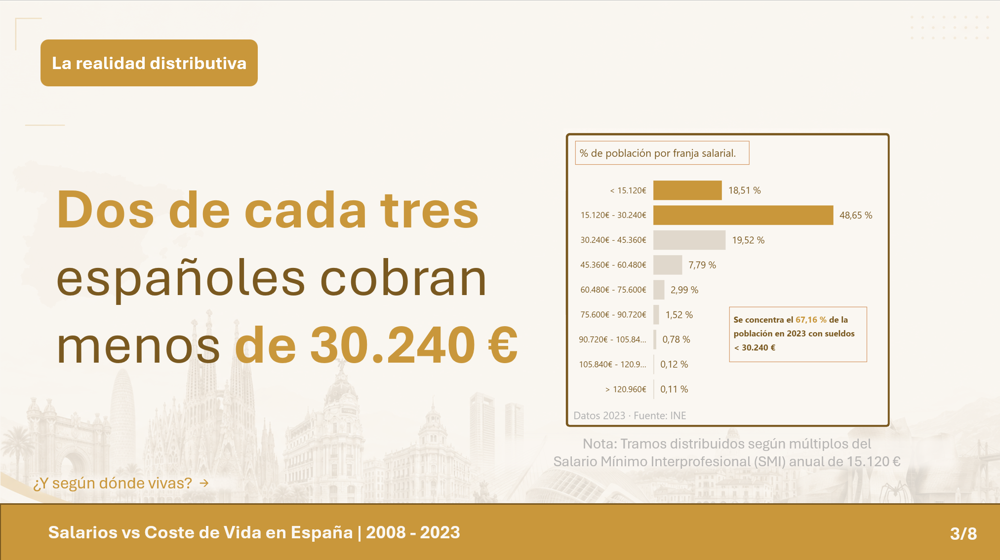
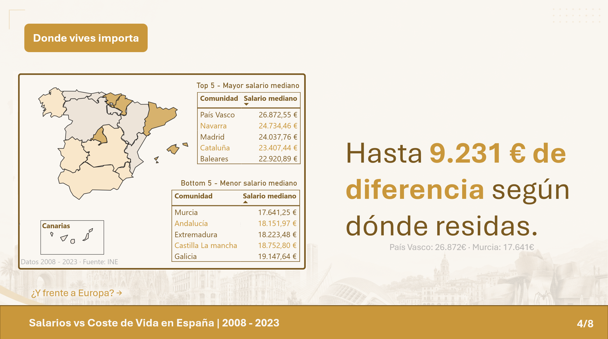
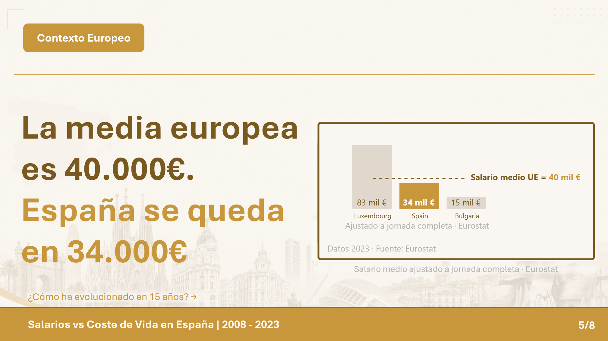
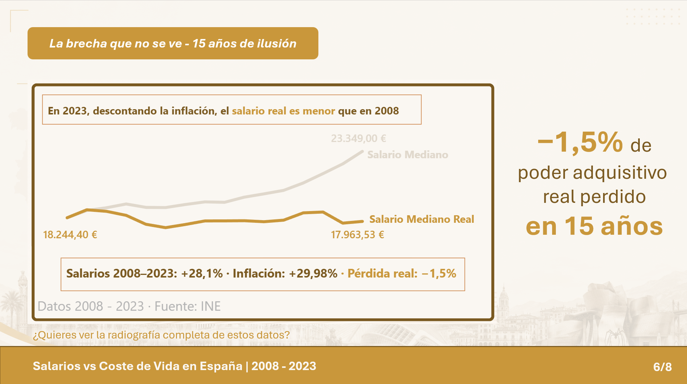
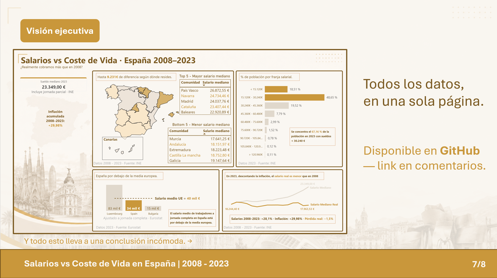

# Salarios vs Coste de Vida · España 2008–2023

## Data Storytelling
*Desliza para ver los puntos clave del análisis o consulta el [Carrusel Completo](carrusel_linkedin_salarios_españa.pdf)*

  
  

  
  

  
  

## Project Overview
Este dashboard analiza la evolución del poder adquisitivo en España entre 2008 y 2023, cruzando datos salariales del INE con la inflación acumulada y comparando la posición de España frente a la media europea.

## Key Insights
- **Pérdida real:** A pesar de una subida nominal del +28,1% en el salario mediano, la inflación acumulada del +29,98% supone una pérdida de poder adquisitivo real del **−1,5%** respecto a 2008.
- **Brecha territorial:** Existe una diferencia de hasta **9.231€** en el salario mediano según la comunidad autónoma de residencia (País Vasco vs. Murcia).
- **Concentración salarial:** El **67,16%** de la población española cobra menos de 30.240€ anuales.
- **Posición europea:** El salario medio en España (34.000€ ajustado a jornada completa) se sitúa por debajo de la media de la UE (40.000€).

## Stack Tecnológico
- **Herramienta de BI:** Power BI Desktop.
- **Fuentes de Datos:** INE (salarios por CCAA y IPC nacional) · Eurostat (nama_10_fte).

## Contenido del Repositorio
- `salarios-españa.pbix`: Archivo fuente con el modelo de datos y dashboard.
- `Dashboard.png`: Captura de pantalla del diseño final del dashboard.
- `carrusel_linkedin_salarios_españa.pdf`: Storytelling del dashboard en formato carrusel.

---

### 💼 Contacto
- **LinkedIn:** Juan Luis España Ramírez
- **Email:** juanluis.analytics@outlook.es
